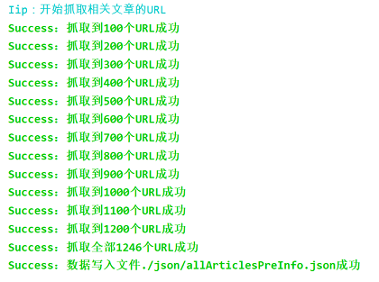
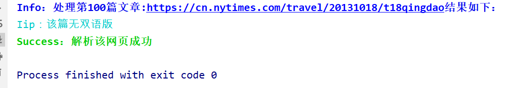
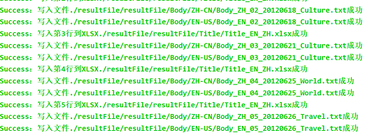

# 项目简介

`python`爬虫开源项目，目前有两个，分别是纽约时报以及 emojis。

# NewYork

爬取纽约时报下与查询关键字相关的所有文章，多进程爬取多页面。

作者爬取的是涉及一带一路的文章，足足有 1246 篇文章。

项目比较系统，对接口的封装比较完善，适合已经入门的 python 选手练手爬虫项目，
同时项目也涉及到文件操作，不只是简单的 TXT 文件，还包括 excel 表格。

## 更详细的过程在本人博客中

[博客地址](https://blog.yulovexin.xyz/other/python-pa-chong-pa-qu-niu-yue-shi-bao.html)

## 相关 modules

项目涉及到`python`的网路请求模块`requests`,
列表格式与 str 类型相互转换的`json`模块,正则表达式模块`re`,
`excel`文件操作模块`openpyxl`,`html`分析模块`pyquery`,
以及最重要的`python`多进程模块`multiprocessing`,主要使用里面的`Pool`线程池。 ####**注意**:请务必确定阁下已经配置好 python 以及安装好上述模块

## 项目流程讲

    1.第一步，获得关键词查询的所有文件的URL,写入到文件"./json/allArticlesPreInfo.json"中
    2.第二步，从上述json问取得文章URL，爬取全部文章段落以及标题等信息，写入"./json/allArticlesPageInfo.json"中
    3.从上述两个json文件中取得所有文章的必须信息，然后按格式写入TXT和excel表格中。
    4.细节处理，异常分析，异常处理。

## py 文件简要介绍

### \_file.py 文件

文件操作

包括：
writeToTxt(filename, arr):写入到 TXT 文件中

writeToXlsx(filename, date, title_EN, title_ZH, type, row):写入到 excel 表格中

writeToFile(filename,data):把 data 写入到文件中

getFileData(filename):从文件中获得数据

### \_format.py 文件

格式化操作

包括：

numberFormat(number,length):把 number 转化为长度 length，不足前面补零

dateFormat(date):把年月日格式转化为数字格式，例如 2019 年 1 月 1 日格式化为 20190101

urlGetType(url):截取 url 一部分获得文章类型

### printState.py

封装输出格式化

printError(\_str):输出错误信息

printSuccess(\_str):输出执行成功的提示信息

printInfo(\_str):输出普通信息

printTip(\_str):输出提示信息

### getAllArticlesPreInfo.py 文件

获得查询的关键值返回的所有文章的 URL 等基本信息

getAllArticlesPreInfo(query = "一带一路",filename = "./json/allArticlesPreInfo.json"):

获得关键字 query 返回的所有页面的 URL 等基本信息,写到文件 filename 中



### getSingleArticleInfo.py

获得单个 URL 的文章信息，返回结果



### getAllArticlesPageInfo.py 文件

获得全部页面文章信息

默认打开./json/allArticlesPreInfo.json 文件，获得每个页面的 URL 等基本信息，放到列表 articlesPreInfo 中

再提取所有页面的文章信息，放到列表 articlesPageInfo 中

列表 articlesPageInfo 和 articlesPreInfo 相同 index 处对应同一篇文章。

相关函数：

allArticles(articlesPreInfo, start):提取列表 articlesPreInfo 的全部文章信息，返回结果列表

getAllArticlesPageInfo(openfilename,writefilename):以多进程提取 URL 中的文章,把结果写到 writefilename 中

openfilename 默认值是"./json/allArticlesPreInfo.json",writefilename 默认值是"./json/allArticlesPageInfo.json"

### \_write.py 文件

把 getAllArticlesPageInfo 返回的所有页面的文章信息写道 TXT 和 XLSX 中



### main.py

主函数

```python
from getAllArticlesPreInfo import *
from getAllArticlesPageInfo import *
from _write import *
def main():
    query = "一带一路"
    getAllArticlesPreInfo()
    getAllArticlesPageInfo()
    beginWrite()
if __name__ == "__main__":
    main()
```

## 结语

花了两天时间,一步一步写出来。

最大得感悟就是：对于大工程而言，高内聚低耦合是尤其重要，在这个项目中，本人主要通过封装接口降低耦合性，
而且提高代码的可重用性以及可读性。

其他一点小的感悟：对于实际项目而言，前期讲实现后期肝异常，一半以上的时间都在处理细节以及处理异常上了，
这些细节和异常是大部分 bug 的万恶之源，一定要考虑全面完备，处理完善。

# emojis

爬取 unicode 项目，得到每个表情的关键字，所属类别，`unicode`码、`browser`下的符号、`Apple google，windows等平台下的base64图片`。
